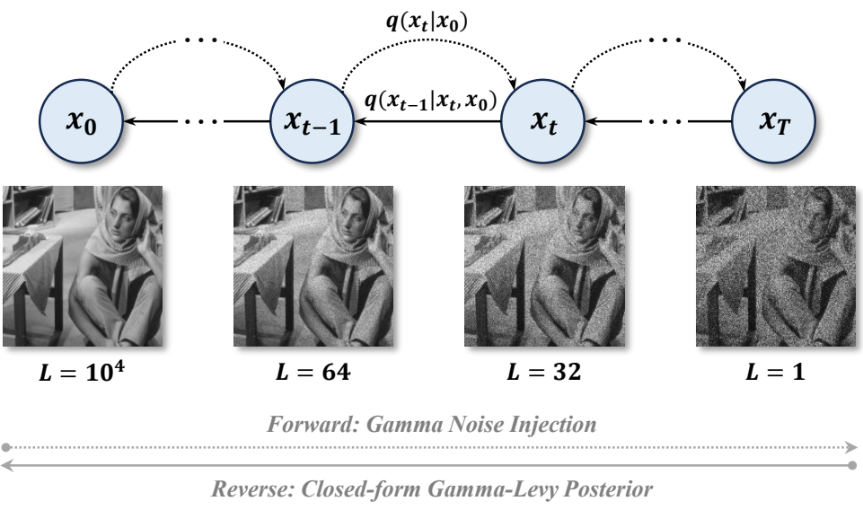
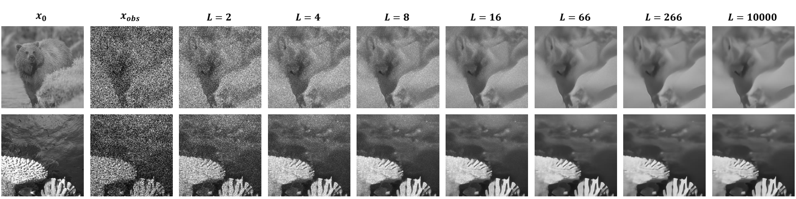
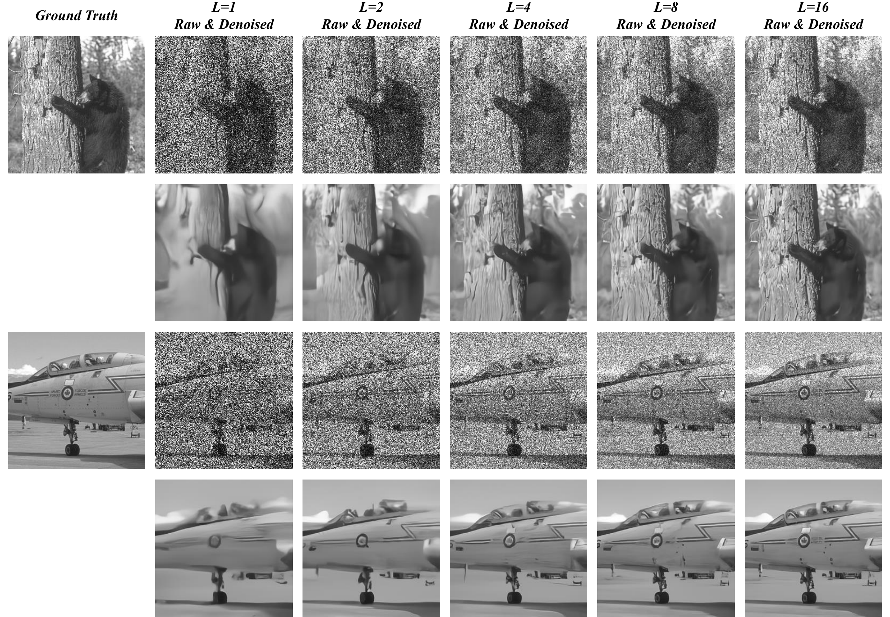
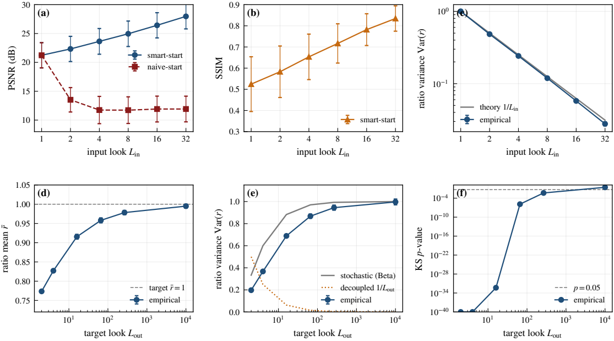
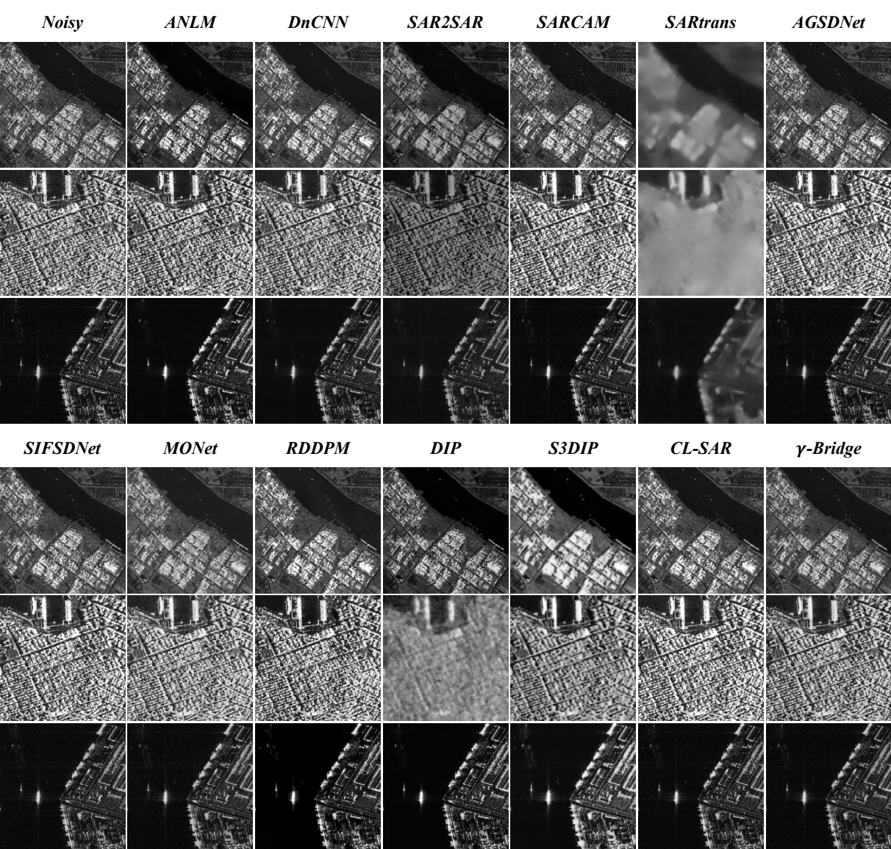

<div align="center">

# γ-Bridge

### _A Look-Parametric Diffusion Bridge_


[](https://www.python.org/)
[](https://pytorch.org/)
[](LICENSE)

<br/>



</div>

<br/>

Official implementation of *γ-Bridge: A Look-Parametric Diffusion Bridge*.

γ-Bridge indexes a diffusion bridge by the **physical look number** rather than an abstract noise schedule. Every intermediate state along the bridge is a physically valid look parametric image with exact Gamma marginals, and a closed-form Gamma–Lévy reverse posterior admits both stochastic and deterministic updates. Combined with observation conditioning and a two-step consistency loss, a single network trained on natural images with synthetic single-look corruption performs zero-shot restoration across a range of input/output look numbers and transfers to spaceborne and airborne SAR sensors *without* sensor-specific fine-tuning.

---

## Runtime Controls

Two orthogonal controls at inference, both without retraining:

- **Target-look output** &nbsp;— terminate the reverse chain at any desired output look number to obtain a calibrated multi-look image with matching Gamma statistics.
- **Smart-start input** &nbsp;— anchor an observation with an estimated effective look number to the matching bridge step and run the reverse chain from there.

<div align="center">
  
</div>

---

## Repository Layout

```
gamma-bridge/
├── train.py                  synthetic training (BSDS500 + DIV2K, DDP-ready)
├── sample.py                 multi-step reverse with optional target-L
├── requirements.txt
├── gbridge_core/
│   ├── diffusion.py          GammaBridge: forward q, closed-form Levy posterior
│   ├── network.py            UNet + log-L conditioning
│   └── gd/                   guided-diffusion UNet blocks
├── models/gamma_bridge.py    exact Gamma forward kernel + L(t) schedule
├── data/                     BSDS500 loaders + downloader
├── eval/                     PSNR / SSIM / ratio-statistic evaluation
├── figures/                  paper-figure reproduction scripts
├── scripts/                  ablation and control helpers
├── tests/                    pytest unit tests
└── assets/                   paper-figure PNGs
```

---

## Installation

```bash
conda create -n gbridge python=3.10 -y
conda activate gbridge

pip install -r requirements.txt
pip install torch torchvision --index-url https://download.pytorch.org/whl/cu121
```

---

## Pretrained Model

The flagship checkpoint used in the paper is attached to the
[v1.0.0 release](https://github.com/Teriri1999/GammaBridge/releases/tag/v1.0.0).

```bash
mkdir -p weights
wget -O weights/gbridge_L1.pt \
    https://github.com/Teriri1999/GammaBridge/releases/download/v1.0.0/gbridge_L1.pt
```

Trained on BSDS500 + DIV2K natural images for 15,000 steps with the flagship configuration below.

---

## Data

Training uses **BSDS500 train+val** and **DIV2K train HR** natural images (~1,100 crops of 256 × 256) with synthetic single-look Gamma corruption. No real SAR imagery is used during training.

```bash
# BSDS500 is fetched automatically on first dataloader init, or manually:
python -m data.download_bsds500

# DIV2K HR (~3.4 GB):
mkdir -p data/downloads data/div2k
wget http://data.vision.ee.ethz.ch/cvl/DIV2K/DIV2K_train_HR.zip -P data/downloads
unzip data/downloads/DIV2K_train_HR.zip -d data/div2k
```

---

## Training

The paper's flagship configuration (100-step log schedule spanning single-look to near-clean; loss weights (rec, ratio, cons) = (10, 1, 5); deterministic defaults; a fully convolutional UNet with 64 base channels and (1, 2, 4) multipliers):

```bash
python train.py \
    --L_obs 1.0 --T 100 --L_max 10000 --schedule log \
    --image_size 256 --model_channels 64 \
    --bridge_forward --cond_x1 \
    --lambda_rec 10 --lambda_ratio 1 --lambda_consistency 5 \
    --batch_size 2 --total_steps 15000 \
    --lr_G 1e-4 --ema_decay 0.999 \
    --extra_roots data/div2k/DIV2K_train_HR \
    --out_dir checkpoints/gbridge
```

Multi-GPU:

```bash
torchrun --nproc_per_node=4 train.py [...same flags...]
```

Key flags (`python train.py --help` for the full list):

| Flag | Meaning |
|:---|:---|
| `--L_obs`, `--L_max`, `--T` | bridge endpoints and step count |
| `--schedule` | log or linear interpolation of the look-number schedule |
| `--bridge_forward` | use the Gamma–Lévy bridge forward process |
| `--cond_x1` | pass the observation as a second input channel |
| `--lambda_rec / _ratio / _consistency` | loss weights |
| `--direct_pred` | ablation: linear-residual head |
| `--naive_posterior` | ablation: skip the Lévy posterior |
| `--extra_roots` | extra image folders (e.g. DIV2K HR) added to the training pool |

---

## Evaluation

BSDS500 test set:

```bash
python eval/run_eval.py \
    --ckpt path/to/ckpt.pt \
    --num_samples 64 --num_steps 6 --ot_ode \
    --out_csv eval/results/gbridge_ns6.csv
```

Reports PSNR, SSIM, ratio-image mean & variance, and a Kolmogorov–Smirnov p-value against the reference Gamma distribution.

External synthetic benchmarks (Set12 / Kodak24 / McMaster / BSDS100):

```bash
python eval/run_external.py --ckpt path/to/ckpt.pt --dataset kodak24 --nfe 5 --ot_ode
```


<div align="center">
  
</div>

---

## Sampling

```bash
# Full clean denoise
python sample.py --ckpt path/to/ckpt.pt --num_steps 6 --ot_ode

# Target-look output control
python sample.py --ckpt path/to/ckpt.pt --target_L 8 --num_steps 6 --ot_ode
```

<div align="center">
  
</div>

---

## Real SAR

Trained purely on natural images with synthetic single-look corruption, γ-Bridge combines a homogeneous-patch look-number estimator with smart-start to process real SAR from six sensors — Sentinel-1, TerraSAR-X, Gaofen-3 (spaceborne); miniSAR, FARAD X-band, FARAD Ka-band (airborne).

<div align="center">
  
</div>

### Test-image layout

Drop grayscale SAR amplitude/intensity files into a per-sensor folder.

```
data/external_test/real/
├── Sentinel-1/     ├── TerraSAR-X/    ├── Gaofen-3/     # spaceborne
└── miniSAR/        └── FARAD_X/       └── FARAD_Ka/     # airborne
```

### Zero-shot despeckling

```bash
python eval/run_external.py \
    --ckpt weights/gbridge_L1.pt \
    --only Sentinel-1,TerraSAR-X,Gaofen-3,miniSAR,FARAD_X,FARAD_Ka \
    --num_steps 5
```

| Flag | Meaning |
|:---|:---|
| `--only` | comma-separated sensor folders to process (default: all) |
| `--num_steps` | NFE of the reverse chain (5 is the paper setting) |
| `--real_L_in` | override the auto-estimated `L̂` with a fixed input look number |
| `--stochastic` | Gamma–Lévy stochastic posterior instead of the deterministic update |
| `--no_norm_mean_real` | disable the post-hoc rescaling of the output mean to the input mean |
| `--max_per_dir` | cap the number of images per sensor (quick smoke test) |

### Target-look output on real SAR

Terminating the reverse chain at a finite output look number trades ENL against edge preservation, without retraining:

```bash
python scripts/run_single_sample_multi_Lout.py \
    --src data/external_test/real/Sentinel-1/1.png \
    --out figures/real_sar/Sentinel-1_1 \
    --ckpt weights/gbridge_L1.pt \
    --Louts 8 16 32
```

---

## Reproducing Paper Figures

```bash
python figures/viz_multistep.py --ckpt path/to/ckpt.pt --num_samples 8
python figures/viz_L_sweep.py   --ckpt path/to/ckpt.pt --num_samples 64 --nfe 5
python figures/viz_target_L.py  --ckpt path/to/ckpt.pt --num_samples 6
```

## Citation

If you find this work useful, please cite:

```bibtex
@article{hu2026gamma,
  title={$$\backslash$gamma $-Bridge: A Look-Parametric Diffusion Bridge},
  author={Hu, Xuran and Zhu, Yujie and Wang, Tengxi and Li, Jilong and Zhao, Wufan},
  journal={arXiv preprint arXiv:2607.22719},
  year={2026}
}
```

