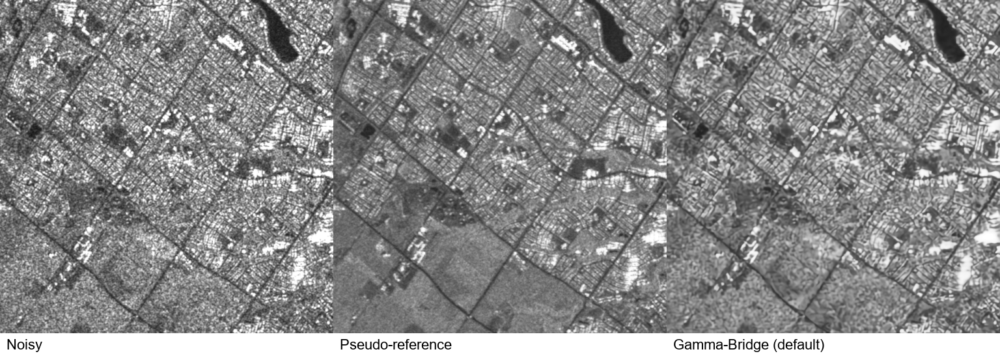
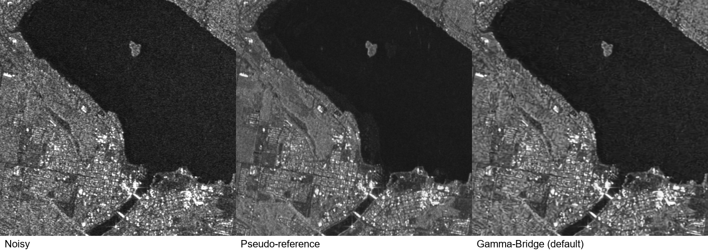
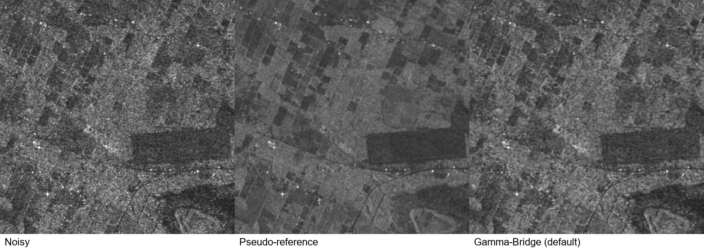

# 第七种 SAR 去噪方法：γ-Bridge 检索与实测

日期：2026-09-26。目的：为现有六种方法补充一种近期、有作者代码和可用权重、能处理 Toronto 单幅 Sentinel-1 图像的方法。

## 推荐结论

推荐将 **γ-Bridge** 作为第七种方法的候选。它是 2026 年 7 月 21 日的 arXiv 预印本，尚不能按已正式发表的期刊论文引用；作者发布了推理代码和预训练权重。当前官方版本已在本机完成三个场景的默认推理，严格加载权重通过，输出有效。

本次三场景平均 PSNR 为 **23.679 dB**、SSIM 为 **0.6731**。与原有 CL-SAR 相比，平均 PSNR 高 0.249 dB、SSIM 低 0.0039；两项均未超过 SAR-BM3D。因此推荐理由是“近期扩散方法、输入条件匹配、实际可运行且有竞争力”，不是“已证明全面最优”。

来源：[论文](https://arxiv.org/abs/2607.22719)、[作者代码](https://github.com/Teriri1999/GammaBridge)、[正式权重发布](https://github.com/Teriri1999/GammaBridge/releases/tag/v1.0.0)。论文的代码链接直接指向该仓库。

## 候选方法与取舍

检索覆盖 IEEE TGRS/JSTARS/GRSL、ISPRS JPRS、JAG、PRL、ESWA、Remote Sensing、Sensors，以及作者大学主页、arXiv 和作者仓库，重点为 2024—2026 年。下表记录截至本次核查的公开交付状态；“未核验到”不等于作者从未发布，也不评价论文算法本身是否有效。

| 方法 | 时间与来源 | 公开材料和当前适配情况 | 取舍 |
| --- | --- | --- | --- |
| γ-Bridge | [arXiv，2026-07](https://arxiv.org/abs/2607.22719) | [代码及权重](https://github.com/Teriri1999/GammaBridge/releases/tag/v1.0.0)可用；支持单通道输入，官方真实数据流程含 Sentinel-1；本机已实测 | 优先补入，注明预印本 |
| Geometry-Calibrated Closed-Form Shrinkage | [arXiv，2026-08](https://arxiv.org/abs/2608.15028) | [作者代码](https://github.com/Teriri1999/Geometry-Calibrated-Closed-Form-Shrinkage)提供免训练算法，无需权重；未在本次运行 | 更新的模型驱动备选，不是预训练深度网络 |
| S3DIP | [PRL，2025](https://doi.org/10.1016/j.patrec.2025.02.021) | [作者代码](https://github.com/IAPP-Group/S3DIP)逐图优化，无需预训练权重；依赖 SAR-BM3D/FANS 引导，默认 10,000 次迭代；存在设备参数与停止准则适配问题 | 若要求正式发表，可作为备选；不是即开即用 |
| SDS-SAR | [ISPRS JPRS，2026](https://doi.org/10.1016/j.isprsjprs.2025.11.025) | [当前公开测试模型](https://github.com/YYF121/SDS-SAR/blob/82541722491054b1ca6605012e0561bcf0cc1d6b/src/models/placeholder_model.py)是中值滤波占位模型 | 暂不纳入；不能把占位输出标成论文方法 |
| GLCNet / LGCN | [JAG，2026](https://doi.org/10.1016/j.jag.2026.105135) | [作者仓库](https://github.com/yangyang12318/LGCN)有网络代码，README 仍称测试流程和权重将发布 | 未满足即用复现条件 |
| SemDNet | [ESWA，2026](https://doi.org/10.1016/j.eswa.2025.129200) | [作者仓库](https://github.com/BFY-official/SemDNet)未核验到所需阶段权重；当前测试含随机语义输入 | 未满足完整推理条件 |
| SAR-FAH | [2025 预印本，2026 更新](https://arxiv.org/abs/2511.05890) | [仓库](https://github.com/mia681912/SAR-FAH)有训练和网络代码，本次未核验到预训练权重 | 暂缓 |
| DA-PhysDiff | [GRSL，2026](https://ieeexplore.ieee.org/abstract/document/11343794) | [仓库](https://github.com/luyaowang-cv/DA-PhysDiff)当前仅 README | 暂缓 |
| SAR-DDPM-Aggregation | [Sensors，2025](https://www.mdpi.com/1424-8220/25/7/2149) | [代码](https://github.com/asp6244/SAR-DDPM-Aggregation)提供通用高斯扩散初始化入口，未核验到即用 SAR 去斑权重 | 需要额外训练，非本次优先 |
| LLaRS | [arXiv，2026](https://arxiv.org/abs/2604.05629) | [作者仓库](https://github.com/yc-cui/LLaRS)包含 Toronto 数据实验线索，但说明权重待后续版本发布 | 数据匹配，但现阶段不便直接复现 |

另检索了 DiSpeckle、Speckle2Self、线性角注意力 Transformer 等近期论文，未确认适合当前输入的完整即用发布，因此没有仅依据摘要将它们列为可直接替换的方法。

## 三场景默认设置实测

数据使用已经选定的三个 512×512 图块，没有按新方法输出重新选图。参考图来自 Toronto 数据集发布的十次观测平均，是多时相伪参考，并非严格无噪声物理真值。[数据集 v2](https://data.mendeley.com/datasets/2xf5v5pwkr/2)、[数据论文](https://pmc.ncbi.nlm.nih.gov/articles/PMC10838683/)

| 场景 / 原始文件 | Noisy PSNR / SSIM | γ-Bridge PSNR / SSIM | CL-SAR PSNR / SSIM | SAR-BM3D PSNR / SSIM |
| --- | ---: | ---: | ---: | ---: |
| 城市路网 / 5120_3072.tiff | 19.627 / 0.6062 | 21.131 / 0.6724 | 20.836 / 0.6642 | 21.629 / 0.6801 |
| 水湾与滨水建成区 / 5632_20992.tiff | 23.902 / 0.6716 | 25.246 / 0.7561 | 24.866 / 0.7588 | 25.908 / 0.7973 |
| 规则农田 / 5120_22528.tiff | 22.787 / 0.4830 | 24.659 / 0.5908 | 24.588 / 0.6079 | 25.709 / 0.6445 |
| 三图算术平均 | 22.106 / 0.5870 | 23.679 / 0.6731 | 23.430 / 0.6770 | 24.415 / 0.7073 |

PSNR 单位为 dB；指标在未裁剪浮点结果上计算，统一 `data_range=255`。CL-SAR 和 SAR-BM3D 数值来自[上一轮同图实验记录](../toronto_showcase_20260926/metrics.json)，本次没有重新运行这两种方法。γ-Bridge 的指标由独立计算得到，并用原实验的指标函数复核，三项 PSNR/SSIM/MSE 差值均为 0。

γ-Bridge 三图均改善相对参考的 PSNR 和 SSIM，平均较 Noisy 增加 1.573 dB 和 0.0862。城市道路、水岸轮廓、农田边界仍可辨认；部分区域有细碎纹理化残留，水面也未达到参考图的平滑程度。主观质量和 ratio 结构残留应在正式七方法组图中继续对照。







三组图均采用同一 0—255 显示窗，无单方法独立拉伸。PNG 仅用于展示，少量超出 255 的预测在显示时截断；完整值保留在 NPY 中，未在指标计算前截断。

## 本地复现条件

- GPU：NVIDIA RTX 4070 Laptop，8 GB。Python 3.12.13、PyTorch 2.5.1、CUDA 12.4；独立环境 `.venv-gamma-bridge`，未修改原六方法环境。
- 源码：`external/GammaBridge`，commit `35d49ed2e7c3fbb3c7bb66fe0e3d859a1411f5ef`，上游文件未修改。
- 权重：`E:/SAR_Models/GammaBridge/gbridge_L1.pt`，135,385,184 字节；使用 15,000 步 EMA 状态。SHA256 为 `3f9aae3e638e814a706852a8cd5896df279b2a74b7347ecd609d75e7baff9b2d`，与 GitHub 发布资产一致。
- 权重以 `weights_only=True` 读取，以 `strict=True` 加载；220 个状态张量完整匹配，缺失与多余键均为 0。仅验证公开 checkpoint 推理，不代表已复现全部训练过程。
- 输入：已准备的发布灰度数据 `noisy_intensity.npy / 255`，保留 float32，不再开方、重新归一化或缩放图像尺寸。该发布数据经过灰度映射，不能视为原始校准后向散射系数。
- 推理：直接调用作者 `denoise_one`，自动估计视数，32×32 窗口、步长 16、ENL 第 90 百分位；`num_steps=5`、确定性 OT-ODE、512 分块设置。三图实际均为 4 次网络前向；不将 5 个时间点误报为 5 次前向。
- 后处理：保留作者真实图默认的输入/输出均值匹配；校正前结果另存 `before_mean_matching.npy`。三图均值因子分别约 0.99976、1.00298、1.00065。
- 没有使用参考图确定视数、均值因子、步数或模型选择参数；参考图只在推理完成后读取计算指标。

| 场景 | 自动估计有效视数 | 单次推理耗时 / s | PyTorch 峰值分配显存 / MiB |
| --- | ---: | ---: | ---: |
| 城市路网 | 19.027 | 1.124 | 2497.85 |
| 滨水场景 | 31.362 | 0.787 | 2497.85 |
| 规则农田 | 23.918 | 0.767 | 2497.85 |

耗时包含默认去噪调用及 GPU 同步，不含下载、模型加载、视数估计、指标计算和文件保存；这是各一张图的实测，不是重复基准均值。城市图另在独立进程重复运行一次，浮点输出逐元素一致，最大绝对差为 0。有效视数是该发布灰度域下的算法估计，不能据此反推传感器的物理视数。

## 使用时保留的限制

1. γ-Bridge 目前为预印本。本次结果仅支持当前三张图上的推理适配，不支持“已证明真实 SAR 全面最优”。三张图来自同一数据集，不能替代多传感器稳定性验证。
2. [作者训练脚本](https://github.com/Teriri1999/GammaBridge/blob/35d49ed2e7c3fbb3c7bb66fe0e3d859a1411f5ef/train.py)的快速 PSNR 计算对残差做了单侧截断；本次未使用该指标，采用原项目统一的双侧误差计算。默认真实推理入口本身可正常执行，但不据此保证仓库所有训练/评价入口均正确。
3. 公开 checkpoint 的部分训练参数与当前 README 描述不完全对应，例如 checkpoint 中 `extra_roots=None`；本次保留原始 checkpoint 参数，不声称重新核验了训练数据构成。
4. 顶层 LICENSE 标为 MIT，但 `gbridge_core/diffusion.py` 头部注明派生结构来自 NVIDIA I2SB 的非商业研究许可；不要概括为不受限制的商业开源授权。[许可文件](https://github.com/Teriri1999/GammaBridge/blob/main/LICENSE)、[来源说明](https://github.com/Teriri1999/GammaBridge/blob/main/gbridge_core/diffusion.py)
5. 原六方法中的异常结果仍应按原实验报告复核；添加新方法不会自动修复旧方法的数值域或模型迁移问题。

## 文件与重跑

- [推理和指标完整记录](probe.json)
- [独立复现脚本](../../scripts/probe_gamma_bridge_toronto.py)
- [城市单张结果](01_city_roads/denoised.png)、[滨水单张结果](02_waterfront/denoised.png)、[农田单张结果](03_farmland/denoised.png)
- 每个场景目录同时保存未裁剪 `denoised.npy` 和输入 SHA256；未覆盖原六方法输出或 Word 文档。

在项目根目录执行，输出目录必须是新的目录：

```powershell
& '.venv-gamma-bridge\Scripts\python.exe' 'scripts\probe_gamma_bridge_toronto.py' --scenes 01_city_roads 02_waterfront 03_farmland --output 'output\gamma_bridge_retest'
```

建议正式七方法比较保留当前默认参数和统一显示窗，使用方法名 **γ-Bridge (2026, preprint)**。后续如调整参数，应另存实验并说明规则，不用测试参考图挑选最优配置。
