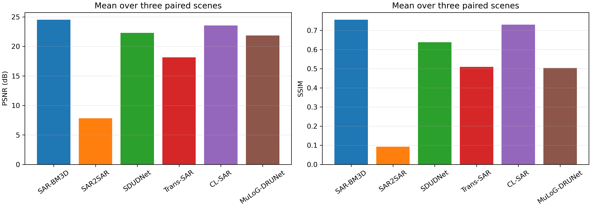

# Toronto Sentinel-1 配对真值三场景去斑实验报告

日期：2026-09-22  
实验对象：真实 Sentinel-1 GRD-HD 单时相 SAR 与 10 时相融合参考图  
图像规格：512 × 512，VV 极化，发布值域为 8-bit `[0,255]`

## 1. 实验目的

在同一公开配对数据集上选取三幅地物组成不同的 SAR 图像，比较图 3 所列方法在有参考图条件下的去斑表现，并用 PSNR、SSIM 和 MSE 检查结果是否随场景变化保持一致。

## 2. 数据与参考真值

主实验采用 Vasquez-Salazar 等发布的 **SAR despeckling filters dataset v2**。作者从同一区域的 10 景 Sentinel-1 GRD-HD VV 图像中选取一景作为含噪输入，其余处理包括 8-bit 重标度、配准与多时相平均；同名 `Noisy_val` 和 `GTruth_val` 图像构成逐像素配对。论文和数据页面将融合结果称为 ground truth，本报告沿用该命名，但其物理含义是**10 时相融合伪真值**，不是可直接测得的无斑点真实后向散射。

选取的三个验证样本均来自同一幅 Toronto 大图的非重叠裁块：

| 场景 | 文件名 | 主要地物 |
|---|---|---|
| 1 | `5120_10240.tiff` | 密集城区、道路与人工构筑物 |
| 2 | `5120_15360.tiff` | 湖岸、城区与农田混合区域 |
| 3 | `5120_25088.tiff` | 水域、岛屿/岸线与农田 |

配对文件及处理后的单通道数组保存在 `E:\SAR_Data\Toronto_Paired_SAR\selected`。原始 TIFF 为三个数值相同的灰度通道；实验只取第一通道，不进行空间重采样。

## 3. 方法与评价设置

所有方法使用作者发布的预训练权重或原始软件包，输入均解释为单视强度图，`L=1`。CL-SAR、Trans-SAR 和 MuLoG-DRUNet 使用固定尺度 255；SDUDNet 按官方 `ToTensor` 规则除以 255；SAR-BM3D 在算法入口对强度开方、输出后平方；SAR2SAR 在其官方对数幅度域运行。方法输出还原到 `[0,255]` 强度单位后再评价。

指标在未做视觉拉伸、未按参考图拟合、未对科学数组截断的结果上计算：

- `MSE = mean((output - GT)^2)`；
- `PSNR = 10 log10(255²/MSE)`；
- SSIM 使用 `data_range=255`；
- 组合图仅为显示而截断到 `[0,255]`。

图 3 中的 MERLIN 需要复数 SLC 的实部与虚部。该数据集只提供 GRD 强度图，无法恢复真实相位，因此本次将 MERLIN 标记为 **N/A**，没有用零相位或随机相位伪造输入。其余六种方法完成三景推理。

## 4. 定量结果

### 4.1 分场景结果

| 场景 | 方法 | PSNR / dB | SSIM | MSE |
|---|---|---:|---:|---:|
| 城区 | Noisy | 20.26 | 0.742 | 611.86 |
| 城区 | SAR-BM3D | **21.74** | **0.763** | **435.48** |
| 城区 | SAR2SAR | -1.47 | -0.095 | 91182.60 |
| 城区 | SDUDNet | 20.48 | 0.741 | 581.94 |
| 城区 | Trans-SAR | 14.84 | 0.232 | 2133.43 |
| 城区 | CL-SAR | 20.73 | 0.751 | 549.04 |
| 城区 | MuLoG-DRUNet | 16.48 | 0.192 | 1463.16 |
| 湖岸—城区—农田 | Noisy | 22.53 | 0.557 | 363.36 |
| 湖岸—城区—农田 | SAR-BM3D | **26.10** | **0.754** | **159.60** |
| 湖岸—城区—农田 | SAR2SAR | 11.04 | 0.145 | 5112.82 |
| 湖岸—城区—农田 | SDUDNet | 22.76 | 0.581 | 344.51 |
| 湖岸—城区—农田 | Trans-SAR | 19.30 | 0.607 | 763.91 |
| 湖岸—城区—农田 | CL-SAR | 24.77 | 0.714 | 216.80 |
| 湖岸—城区—农田 | MuLoG-DRUNet | 23.50 | 0.613 | 290.31 |
| 水域—岛屿—农田 | Noisy | 23.49 | 0.572 | 290.82 |
| 水域—岛屿—农田 | SAR-BM3D | **25.76** | **0.753** | **172.46** |
| 水域—岛屿—农田 | SAR2SAR | 13.86 | 0.228 | 2670.68 |
| 水域—岛屿—农田 | SDUDNet | 23.65 | 0.592 | 280.80 |
| 水域—岛屿—农田 | Trans-SAR | 20.27 | 0.690 | 611.74 |
| 水域—岛屿—农田 | CL-SAR | 25.16 | 0.726 | 198.17 |
| 水域—岛屿—农田 | MuLoG-DRUNet | 25.55 | 0.705 | 181.12 |

### 4.2 三场景均值

| 方法 | 平均 PSNR / dB | 相对 Noisy / dB | 平均 SSIM | 相对 Noisy | 平均 MSE |
|---|---:|---:|---:|---:|---:|
| Noisy | 22.10 | — | 0.624 | — | 422.01 |
| SAR-BM3D | **24.54** | **+2.44** | **0.756** | **+0.133** | **255.84** |
| SAR2SAR | 7.81 | -14.28 | 0.093 | -0.531 | 32988.70 |
| SDUDNet | 22.30 | +0.20 | 0.638 | +0.015 | 402.42 |
| Trans-SAR | 18.14 | -3.96 | 0.510 | -0.114 | 1169.69 |
| CL-SAR | 23.56 | +1.46 | 0.730 | +0.107 | 321.34 |
| MuLoG-DRUNet | 21.84 | -0.25 | 0.504 | -0.120 | 644.86 |

SAR-BM3D 在三幅图上同时提高 PSNR 和 SSIM，且三景均为最高值；CL-SAR 在三景上也均优于含噪输入，平均 PSNR 提高 1.46 dB。SDUDNet 的变化较小，平均提高 0.20 dB。MuLoG-DRUNet 在水域—岛屿—农田场景达到 25.55 dB，但在高密度城区下降到 16.48 dB，场景依赖明显。

SAR2SAR 的城区输出出现极高强度离群值，未截断最大值约为 `1.08×10^5`，导致 PSNR 为负；图中白黑饱和并非显示拉伸造成。Trans-SAR 和 MuLoG-DRUNet 在城区产生明显过平滑。该结果反映了发布权重与本数据集 8-bit 重标度域之间的分布差异，不应将其解释为这些方法在各自论文测试集上的性能。

## 5. 视觉对比

### 场景 1：密集城区

SAR-BM3D 与 CL-SAR 保留了道路和街区轮廓；SDUDNet 的纹理变化较小。Trans-SAR 和 MuLoG-DRUNet 对细密建筑纹理的平滑最明显，SAR2SAR 出现大范围饱和和振铃样伪影。

### 场景 2：湖岸—城区—农田

SAR-BM3D 的 PSNR/SSIM 为 26.10 dB/0.755；CL-SAR 为 24.77 dB/0.714。两者都降低了农田区域的颗粒波动，同时保持岸线和道路。MuLoG-DRUNet 的均匀区更平滑，但部分田块边界减弱。

### 场景 3：水域—岛屿—农田

水域场景中，SAR-BM3D、MuLoG-DRUNet 和 CL-SAR 的 PSNR 分别为 25.76、25.55 和 25.16 dB。MuLoG-DRUNet 在该场景表现较好，但其城区结果明显下降，因此不能据单一水域样本判断整体稳定性。

## 6. 当前判断

在这三幅同源配对图上，SAR-BM3D 的定量结果最稳定，CL-SAR 次之；二者均未出现某一场景突然低于含噪输入的情况。SDUDNet接近输入基线。Trans-SAR、SAR2SAR 和 MuLoG-DRUNet 对发布图像的重标度域较敏感，其中 SAR2SAR 的离群输出需要单独报告，不能通过事后截断或单图拉伸掩盖。

该实验可以满足“使用有 ground truth 的 SAR 图像做测试”的要求，但论文中应准确写成“真实单时相 Sentinel-1 SAR + 多时相融合参考”，不要写成“物理无噪真值”。

## 7. 2026 全球数据集核查

已下载的 2026 全球 Sentinel-1 数据保存在 `E:\SAR_Data\Sentinel1_Despeckling_GT25`：

- `dataset.rar`：SHA-256 `6220032dcb9e733dadf43cd764cb69b8f250158a1c2e72c2d6e3567dc92e6cfc`；
- `fusion.rar`：SHA-256 `3b2f2ea9eb95a2008ee4c6bcf1da1301df8f07d50c83a3f958a9bd011b657847`。

对官方发布包的实际文件名进行核查后，`dataset.rar` 中 161 个原始场景 ID 与 `fusion.rar/GT25` 中的参考场景 ID 没有交集，无法从该版本直接组成逐像素输入—真值对。尽管论文和数据页面说明可直接配对，本次不使用错配文件计算指标；三个示例 GT 图仍保存在 `selected` 子目录，仅作数据核查材料。

## 8. 文件与复现入口

- 指标明细：`output/toronto_gt_benchmark/metrics.csv`、`metrics.json`；
- 三景均值：`output/toronto_gt_benchmark/averages.json`；
- 无文字单图：每个场景的 `figures/panels`；
- 原始方法输出与日志：每个场景的 `runs`、`logs`；
- 数据准备：`scripts/prepare_toronto_gt_benchmark.py`；
- 方法运行：`scripts/run_toronto_gt_methods.py`；
- 指标与绘图：`scripts/summarize_toronto_gt_benchmark.py`。

## 9. 数据与代码来源

1. R. D. Vasquez-Salazar et al., “Labeled dataset for training despeckling filters for SAR imagery,” *Data in Brief*, 53, 110065, 2024. [论文](https://doi.org/10.1016/j.dib.2024.110065)；[数据集 v2](https://data.mendeley.com/datasets/2xf5v5pwkr/2)；[作者数据生成代码](https://github.com/rubenchov/SAR_despeckling_dataset)。
2. J. P. Díaz-Paz et al., “Labeled dataset of Sentinel-1 SAR imagery Despeckled with multitemporal fusions,” *Data in Brief*, 67, 112999, 2026. [论文](https://doi.org/10.1016/j.dib.2026.112999)；[数据集 v1](https://data.mendeley.com/datasets/6nzd6x25vw/1)。
3. SAR-BM3D：S. Parrilli et al., *IEEE TGRS*, 2012. [论文](https://doi.org/10.1109/TGRS.2011.2161586)；[作者软件 v1.0](https://www.grip.unina.it/download/prog/SAR-BM3D/version_1.0/)。
4. [SAR2SAR 官方代码](https://gitlab.telecom-paris.fr/ring/sar2sar)，本次固定 commit `ca3c783333cbe072743f0b8060b5f168b9f0db11`。
5. [SDUDNet 官方代码](https://github.com/BFY-official/SDUDNet)，本次固定 commit `0c799911e84ef79c5fbe6f58f44cb8ee033048a1`。
6. [Trans-SAR 官方代码](https://github.com/malshaV/sar_transformer)，本次固定 commit `b3ac845f96f2332aa4f1af94b455f71630978b17`。
7. [CL-SAR 官方代码](https://github.com/YangtianFang2002/CL-SAR-Despeckling)，本次固定 commit `b12129d1d3448750b9098b239397587eeb359857`。
8. [MuLoG-DRUNet 官方代码](https://gitlab.telecom-paris.fr/ring/mulog-drunet)，本次固定 commit `f468573f5bd4d7d30065380b8580269bcefbec19`。
