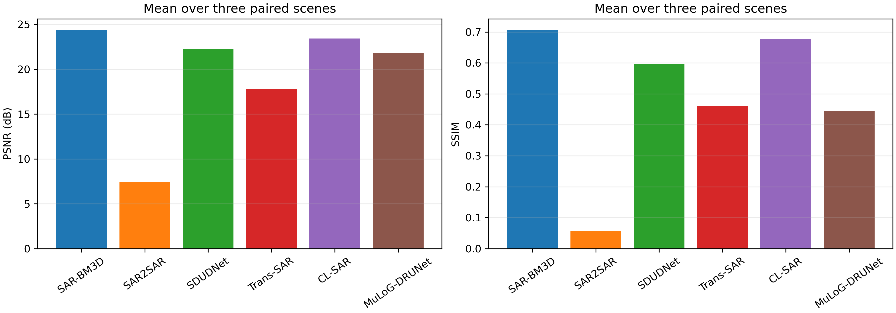
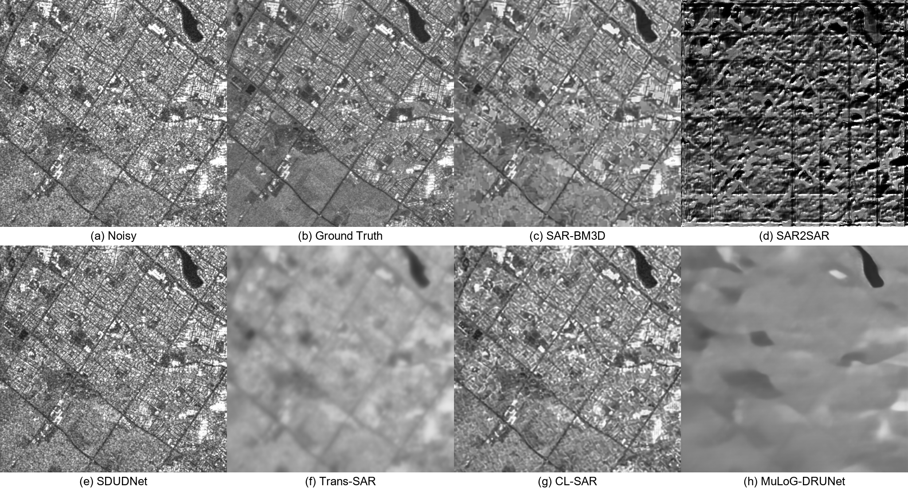
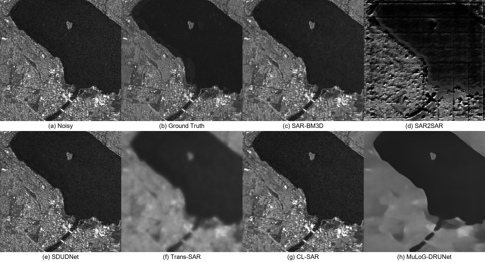
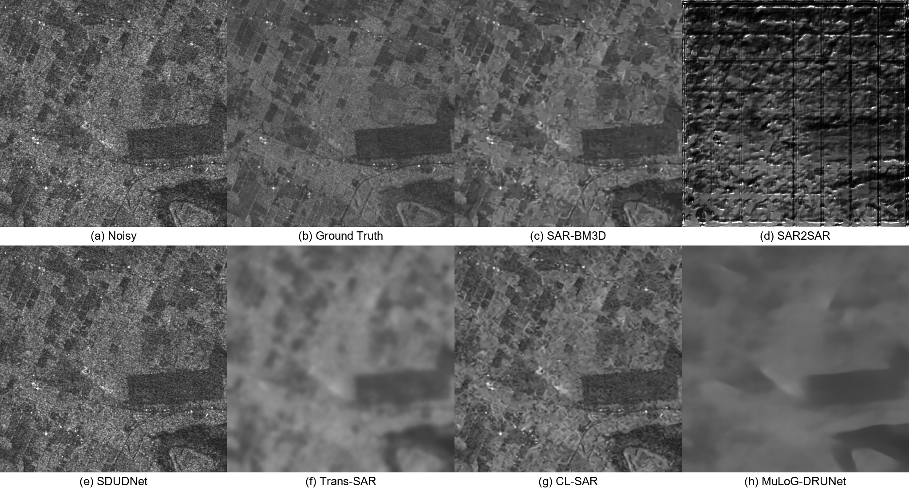

# Toronto Sentinel-1 三类展示场景去斑实验

日期：2026-09-26  
数据：Mendeley Data `10.17632/2xf5v5pwkr.2`，`Noisy_val`／`GTruth_val`  
规格：512 × 512 像素，Sentinel-1 GRD-HD VV，发布图像为 8-bit 强度

## 目的与选图

为了让论文对比图分别呈现细密人工结构、强水陆边界和低对比规则纹理，先下载并核对官方验证集全部 100 对图块，仅依据含噪图和配对参考图选出以下三张；选图时未查看任何去斑结果或方法指标。三张均未在上一轮 Toronto 三场景实验中使用。

| 展示类别 | 验证集文件 | 图中可见的主要结构 | 适合观察的差异 |
|---|---|---|---|
| 城市路网与街区 | `5120_3072.tiff` | 斜向道路、密集路网、小尺度强散射点 | 细节与线性边缘是否被抹除 |
| 水湾与滨水建成区 | `5632_20992.tiff` | 大面积暗水面、弯曲岸线、小岛、邻接建成区 | 均匀区平滑与岸线保持 |
| 规则农田 | `5120_22528.tiff` | 矩形地块、细田界、局部道路 | 低对比边界与纹理保持 |

文件名中的两个数字是原大图裁块左上角的行、列像素坐标；三个图块互不重叠。原始配对 TIFF 和逐文件 SHA-256 清单位于 `E:\SAR_Data\Toronto_Paired_SAR\validation_full`；本实验固定的三对输入位于 `E:\SAR_Data\Toronto_Paired_SAR\showcase_selected_20260926`，选图理由记录在 [`selection/selected_scenes.json`](selection/selected_scenes.json)。

## 数据与实验设置

数据作者从 Toronto 同一区域的 10 次 Sentinel-1 GRD VV 成像中取一张单时相图作为含噪输入，将 10 次图像经 8-bit 重标度和配准后逐像素平均，得到发布文件夹中称为 `GTruth_val` 的参考图。因此本文的“Ground Truth”是**多时相融合伪真值**，不是物理上无斑点的真实后向散射。三张图也都来自同一幅原始区域的相邻条带，不能视为三个独立地区或独立采集实验。[数据集 v2](https://data.mendeley.com/datasets/2xf5v5pwkr/2)；[数据论文](https://doi.org/10.1016/j.dib.2024.110065)。

沿用上一轮相同的六种可运行方法与预训练权重：SAR-BM3D、SAR2SAR、SDUDNet、Trans-SAR、CL-SAR、MuLoG-DRUNet。`Noisy` 是输入基线；图中第 8 幅 `Ground Truth` 是配对参考，不是第 7 种模型。MERLIN 需要复数 SLC 实部与虚部，而本数据只有 GRD 强度，故标记为 N/A，不构造虚假相位。

各方法输出先还原至发布图像的强度单位，以**未按真值拟合、未裁剪的数值数组**计算 MSE、`PSNR = 10 log10(255²/MSE)` 和 `SSIM(data_range=255)`。仅为统一展示，对比图将输出截断至 `[0,255]`；这一步不影响下表指标。三张输入均保持原 512 × 512 网格，无空间重采样。完整参数、输入哈希和模型运行记录见各场景的 `run.json`、`experiment_state.json` 与 `runs/*/run.json`。

## 定量结果

| 场景 | 方法 | PSNR / dB | SSIM | MSE |
|---|---|---:|---:|---:|
| 城市路网 | Noisy | 19.63 | 0.606 | 708.49 |
| 城市路网 | SAR-BM3D | **21.63** | **0.680** | **446.85** |
| 城市路网 | SAR2SAR | 2.05 | -0.060 | 40521.66 |
| 城市路网 | SDUDNet | 19.87 | 0.612 | 670.31 |
| 城市路网 | Trans-SAR | 15.43 | 0.282 | 1863.62 |
| 城市路网 | CL-SAR | 20.84 | 0.664 | 536.43 |
| 城市路网 | MuLoG-DRUNet | 18.25 | 0.239 | 972.71 |
| 水湾岸线 | Noisy | 23.90 | 0.672 | 264.78 |
| 水湾岸线 | SAR-BM3D | **25.91** | **0.797** | **166.84** |
| 水湾岸线 | SAR2SAR | 8.20 | 0.191 | 9847.95 |
| 水湾岸线 | SDUDNet | 24.04 | 0.691 | 256.72 |
| 水湾岸线 | Trans-SAR | 19.27 | 0.578 | 768.96 |
| 水湾岸线 | CL-SAR | 24.87 | 0.759 | 212.05 |
| 水湾岸线 | MuLoG-DRUNet | 22.48 | 0.590 | 367.07 |
| 规则农田 | Noisy | 22.79 | 0.483 | 342.26 |
| 规则农田 | SAR-BM3D | **25.71** | **0.645** | **174.67** |
| 规则农田 | SAR2SAR | 11.91 | 0.039 | 4184.16 |
| 规则农田 | SDUDNet | 22.89 | 0.485 | 334.31 |
| 规则农田 | Trans-SAR | 18.81 | 0.524 | 854.39 |
| 规则农田 | CL-SAR | 24.59 | 0.608 | 226.06 |
| 规则农田 | MuLoG-DRUNet | 24.68 | 0.503 | 221.30 |

三景 PSNR 与 SSIM 的简单算术平均（不是像素合并后重新计算）如下。完整精度及输出范围见 [`metrics.csv`](metrics.csv) 和 [`averages.json`](averages.json)。

| 方法 | 平均 PSNR / dB | 平均 SSIM | 平均 MSE |
|---|---:|---:|---:|
| Noisy | 22.11 | 0.587 | 438.51 |
| SAR-BM3D | **24.42** | **0.707** | **262.78** |
| SAR2SAR | 7.39 | 0.057 | 18184.59 |
| SDUDNet | 22.26 | 0.596 | 420.45 |
| Trans-SAR | 17.84 | 0.461 | 1162.32 |
| CL-SAR | 23.43 | 0.677 | 324.85 |
| MuLoG-DRUNet | 21.81 | 0.444 | 520.36 |

SAR-BM3D 在三张图上均取得最高 PSNR/SSIM，PSNR 分别比对应 Noisy 高 2.00、2.01、2.92 dB；CL-SAR 的增量分别为 1.21、0.96、1.80 dB。SDUDNet 与输入接近。MuLoG-DRUNet 在农田图的 PSNR 为 24.68 dB，略高于 CL-SAR 的 24.59 dB，但在另两类场景下降；该结果不能概括为对三类场景均有提升。

SAR2SAR 的未裁剪最大输出在三张图中分别达到约 39,905、27,027、7,436，明显超出 8-bit 输入范围，城市图 SSIM 为负。其异常纹理和低指标均保留，没有通过事后截断修正。不同方法的发布权重与本数据集的 GRD、8-bit 重标度强度域存在训练—测试分布差异；这些数值只说明**本次固定适配器下的跨数据集表现**，不代表各方法在原论文测试域中的排名。

## 视觉对比

下列每幅图从左至右、从上到下为：`Noisy`、数据集 `Ground Truth`、SAR-BM3D、SAR2SAR、SDUDNet、Trans-SAR、CL-SAR、MuLoG-DRUNet。每张小图的无文字 PNG 也保存在相应场景的 `figures/panels` 目录。

### 城市路网与街区

图中斜向道路和密集小块结构便于检查保边。SAR-BM3D 与 CL-SAR 保留了主要路网，Trans-SAR 和 MuLoG-DRUNet 明显平滑细密街区，SAR2SAR 出现强烈振铃样异常纹理。

### 水湾与滨水建成区

暗水面、弯曲岸线及邻接建筑的反差较大。SAR-BM3D 与 CL-SAR 同时降低水面颗粒并保留岸线；Trans-SAR 和 MuLoG-DRUNet 的陆地细节损失较多。

### 规则农田

矩形地块在融合参考中可辨认。SAR-BM3D 的 PSNR/SSIM 最高；CL-SAR 保留较多地块边界；MuLoG-DRUNet 虽接近 CL-SAR 的 PSNR，但图中细田界更弱。

## 复现文件与来源

- 官方验证集 200 个 TIFF 与校验清单：`E:\SAR_Data\Toronto_Paired_SAR\validation_full`；固定三对实验输入：`E:\SAR_Data\Toronto_Paired_SAR\showcase_selected_20260926`。
- 下载、选图、输入准备、运行、指标绘图：[`scripts/download_toronto_validation.py`](../../scripts/download_toronto_validation.py)、[`scripts/preview_toronto_validation.py`](../../scripts/preview_toronto_validation.py)、[`scripts/prepare_toronto_showcase.py`](../../scripts/prepare_toronto_showcase.py)、[`scripts/run_toronto_gt_methods.py`](../../scripts/run_toronto_gt_methods.py)、[`scripts/summarize_toronto_showcase.py`](../../scripts/summarize_toronto_showcase.py)。
- 模型输出、日志与各自的权重/代码版本记录：各场景 `runs` 和 `logs` 子目录；本次仅更正 Trans-SAR 适配器对 Toronto 输入的元数据标注，未更改其数值推理路径。
- 数据来源：R. D. Vásquez-Salazar 等，*Labeled dataset for training despeckling filters for SAR imagery*, *Data in Brief* 53, 110065 (2024)，[论文](https://doi.org/10.1016/j.dib.2024.110065)，[Mendeley Data v2](https://data.mendeley.com/datasets/2xf5v5pwkr/2)，[作者数据处理代码](https://github.com/rubenchov/SAR_despeckling_dataset)。
- 方法代码来源：[SAR-BM3D 作者软件](https://www.grip.unina.it/download/prog/SAR-BM3D/version_1.0/)、[SAR2SAR](https://gitlab.telecom-paris.fr/ring/sar2sar)、[SDUDNet](https://github.com/BFY-official/SDUDNet)、[Trans-SAR](https://github.com/malshaV/sar_transformer)、[CL-SAR](https://github.com/YangtianFang2002/CL-SAR-Despeckling)、[MuLoG-DRUNet](https://gitlab.telecom-paris.fr/ring/mulog-drunet)。
