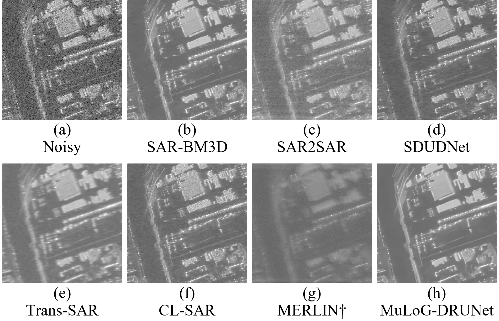
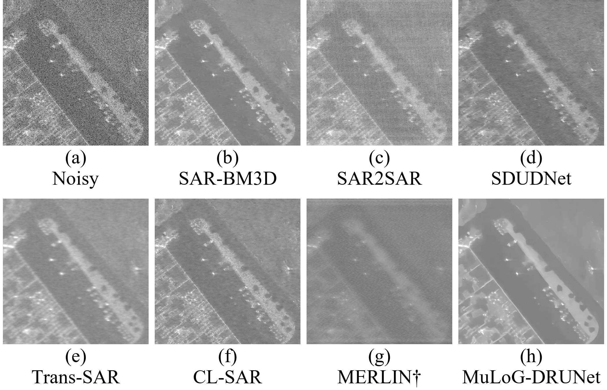
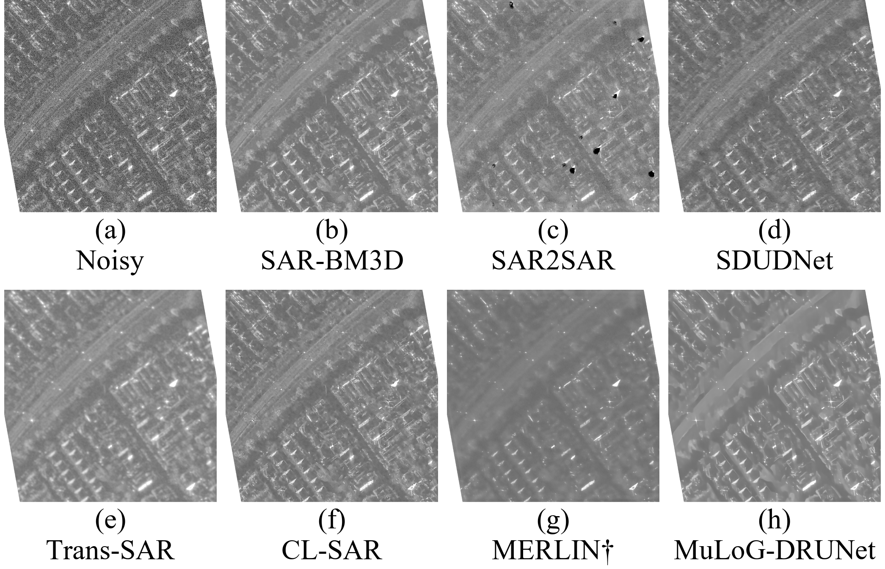

# Umbra 三场景低星芒 ROI：SICD 输入的七方法去斑对比

实验日期：2026-09-24  
数据与范围：香港城市边缘、内华达 Tesla Semi Factory 工业区、墨尔本城区的三次独立 Umbra X 波段 Spotlight / VV 获取；每景一块新的 1024×1024 SICD ROI。  
完成情况：3 景 × 7 方法，**21 次推理全部完成**。本报告和图替代[上一轮高星芒 ROI 的结果](../umbra_stability_new_3scenes/Umbra_三处不同场景_七方法实验报告.md)；上一轮文件保留，不与本轮数值混用。

## 1. 主要结果图

下列 2×4 图的面板依次为 (a) Noisy、(b) SAR-BM3D、(c) SAR2SAR、(d) SDUDNet、(e) Trans-SAR、(f) CL-SAR、(g) MERLIN†、(h) MuLoG-DRUNet。每幅图内的横、纵坐标都按**相同的地面米数/像素**显示；为便于排成论文 Fig. 3 式小图，自动截取了地面投影后的中央正方形。†MERLIN 仅在显示时调整中位亮度，科学数组和 ratio 均未调整。

### 香港城市边缘

中央显示范围约 **153.8 m × 153.8 m**。房屋和道路轮廓可见，原先密集的极亮星芒减少。[查看完整 1024×1024 输入对应的地面投影范围](01_Hong_Kong_Port/experiment/figure3_ground_equal_scale/figure3_ground_equal_scale_7methods_600dpi.png)。

### 内华达工业区

中央显示范围约 **114.4 m × 114.4 m**，可辨认较大建筑边界及周边地表。[查看完整地面投影范围](02_Tesla_Semi_Factory/experiment/figure3_ground_equal_scale/figure3_ground_equal_scale_7methods_600dpi.png)。

### 墨尔本城区

中央显示范围约 **227.9 m × 227.9 m**，道路与街区纹理较明确。SAR2SAR 的 (c) 面板有原始 noisy 中没有的局部孤立黑点，应作为**输出伪影**标注，不能解释为真实地物。[查看完整地面投影范围](03_Melbourne/experiment/figure3_ground_equal_scale/figure3_ground_equal_scale_7methods_600dpi.png)。

三张小图均为 **2091×1345 像素、600 dpi 标记**；[各景无文字单图](01_Hong_Kong_Port/experiment/figure3_ground_equal_scale/panels_word_center_square/)位于对应场景的 `panels_word_center_square/`，可自行在 Word 中排版。三景各占不同的实际地面面积，所以**图内横纵等比例，不代表三幅图之间统一缩放倍数**。完整范围图中的白色三角边是投影后无有效 SICD 像素的区域；墨尔本中央方图也保留约 3.2% 无数据边缘，均不是去斑输出的白斑。

## 2. 选区、数据与处理约束

三处新 ROI 均先从**原始 SICD noisy 图**筛选，再固定坐标并重跑七方法；没有依据去斑结果挑图。统一筛选量为“最亮 105 个像素（约 0.01%）占该 ROI 未定标线性强度总和的比例”，只描述极强散射点的集中程度，不是去斑质量或跨场景辐射指标。[完整候选选择记录](roi_selection.json)。

| 场景／获取日期 | 新 ROI 左上角 (row, col) | 中心经纬度 | 最亮 105 像素强度占比：旧 → 新 | 地面等比例全幅包围框 |
|---|---:|---:|---:|---:|
| 香港／2025-03-07 | (3200, 24200) | 22.329057, 114.104426 | 14.21% → 8.21% | 390.8 × 153.8 m |
| Tesla 工业区／2025-02-21 | (4800, 20500) | 39.544500, −119.470582 | 46.75% → 11.33% | 249.3 × 114.4 m |
| 墨尔本／2025-06-28 | (8612, 5547) | −37.860852, 144.891454 | 18.84% → 9.05% | 275.8 × 227.8 m |

计算输入始终是 E 盘三个完整原始复数 SICD 中裁出的 `complex64` ROI，并按 `I = Re(S)² + Im(S)²` 形成 `float32` 强度；**进入方法之前没有进行 GEC 转换、地面重投影或空间插值**。各场景的[香港输入记录](01_Hong_Kong_Port/roi/run.json)、[Tesla 输入记录](02_Tesla_Semi_Factory/roi/run.json)、[墨尔本输入记录](03_Melbourne/roi/run.json)含原文件路径、SHA-256、ROI 坐标与输入文件校验。完整 SICD 保存在 `E:\SAR_Data\Umbra\Stability_3Scenes_V2`；三景不是同一幅 SICD 的不同裁块。

去斑沿用 Fig. 3 的七套模型和冻结适配器，单视算法设置 `L=1`；此设置**不等于**供应商三个产品都声明为单视。尤其 SDUDNet 经过固定 noisy 显示窗的 8-bit 适配，Trans-SAR 使用 ROI 最大值归一化，方法之间的输出强度尺度不能直接当成经定标后向散射比较。各景的[方法完成记录](01_Hong_Kong_Port/experiment/experiment_state.json)与 `experiment/runs/` 内记录保存实际输入／输出、参数和日志。

**出图才使用地面坐标。**根据 SICD 成像模型在 ROI 内取 5×5 个地面控制点，在 ROI 中心高度的局部东—北切平面拟合仿射映射；以相同米/像素重采样显示用 dB 图，再按原始行方向近水平放置。控制点最大拟合残差依次为 **0.022、0.010、0.022 m**。这不是以 DEM 做的地形正射校正，也不是北向上图；高楼的 SAR 叠掩、阴影和强散射旁瓣仍会存在。与完整图不同，中央方图只改变可见范围，**七方法都已经在整块原始 1024×1024 SICD ROI 上计算**。[地面显示脚本](../../scripts/render_umbra_ground_proportion.py)与各景 `figure3_ground_equal_scale/manifest.json` 记录几何、有效像素比例和文件校验；保留的[香港斜距像素网格图](01_Hong_Kong_Port/experiment/figure3_style/figure3_style_7methods_600dpi.png)可作为未地面校正的对照。

每景八面板共用 noisy 强度 dB 的 **1%–99.7%** 显示窗。MERLIN 的 † 显示图单独减去中位亮度差，香港、Tesla、墨尔本分别为 **11.78、11.62、6.16 dB**；原始方法输出、未平移的科学数组和 ratio 不受影响。不同场景的显示窗不同，不应通过三张图的灰度比较绝对回波强度。

## 3. 跨场景无参考诊断

在未经地面重采样的科学数组上计算 `R_dB = 10 log10(I_noisy / I_output)`。下表为每景像素 ratio 的中位数以及这三个中位数的极差；它仅提示**输出相对 noisy 的比例变化**，不评价真实反射率的误差，也不等同于视觉质量排序。[全部 21 行数值及附加诊断](stability_diagnostics.csv)。

| 方法 | 香港 (dB) | Tesla (dB) | 墨尔本 (dB) | 三景极差 (dB) |
|---|---:|---:|---:|---:|
| SAR-BM3D | −1.34 | −1.47 | −1.42 | 0.13 |
| SAR2SAR | −2.71 | −2.45 | −1.62 | 1.09 |
| SDUDNet | +0.03 | −0.01 | −0.01 | 0.04 |
| Trans-SAR | −2.71 | −2.47 | −2.62 | 0.24 |
| CL-SAR | −0.70 | −0.89 | −0.81 | 0.19 |
| MERLIN | −11.79 | −11.65 | −6.16 | 5.63 |
| MuLoG-DRUNet | −1.64 | −1.77 | −1.75 | 0.14 |

SAR-BM3D、CL-SAR、MuLoG-DRUNet 的**三景中位 ratio 极差**均小于 0.2 dB，但这**不能证明**纹理保留或去斑效果更好。SDUDNet 的中位数接近零亦不是准确度证据：其显示域适配改变了尺度解释。MERLIN 的相对尺度随场景变化较大，因而在主图中另外做了**仅显示用**亮度对齐。视觉上，Trans-SAR 和 MERLIN 的若干细小结构变柔和，MuLoG-DRUNet 的部分区域呈均质化；墨尔本 SAR2SAR 的孤立暗点需特别复核。这些均为本组三块固定 ROI 的定性观察，不作总体模型优劣结论。

**没有无斑地面真值。**SICD 是真实含斑 SAR 观测；同次获取的 GEC / SIDD 也不是 clean ground truth。本轮不报告 PSNR、SSIM 或“最优方法”。若论文需要全参考指标，应另行构建有可信配对参考的测试集。供应商提供的强散射星芒是 SAR 成像响应的一部分，低星芒 ROI 只是让去斑结构更易观察，并非证明星芒被算法消除。

## 4. 文件与复核入口

- [香港结果](01_Hong_Kong_Port/experiment/figure3_ground_equal_scale/)、[Tesla 结果](02_Tesla_Semi_Factory/experiment/figure3_ground_equal_scale/)、[墨尔本结果](03_Melbourne/experiment/figure3_ground_equal_scale/)：中央方图、完整范围图、各方法无文字单图及 ratio 显示图。`manifest.json` 保存等比例几何、图像尺寸与 SHA-256。
- 各景的 `experiment/figure3_style/scientific_arrays.mat` 与 `experiment/figure3_style/ratios/*.npy` 是**未地面重采样**的科学数组；`figure3_ground_equal_scale/` 下的 PNG 仅用于观察与排版。[诊断 JSON](stability_diagnostics.json)说明统计定义。
- 复现脚本：[ROI 准备](../../scripts/prepare_umbra_stability_roi.py)、[七方法运行](../../scripts/run_umbra_stability_methods.py)、[原网格 Fig. 3 布局](../../scripts/render_umbra_stability_comparison.py)、[地面等比例出图](../../scripts/render_umbra_ground_proportion.py)、[无参考汇总](../../scripts/summarize_umbra_stability.py)。

数据出处：[Umbra Open Data](https://umbra.space/open-data/) 与[官方公开 STAC 目录](https://s3.us-west-2.amazonaws.com/umbra-open-data-catalog/stac/catalog.json)；[Umbra 产品类型说明](https://docs.canopy.umbra.space/docs/delivered-product-types)。方法出处：SAR-BM3D [论文](https://doi.org/10.1109/TGRS.2011.2161586)，SAR2SAR [代码](https://gitlab.telecom-paris.fr/ring/sar2sar)，SDUDNet [代码](https://github.com/BFY-official/SDUDNet)，Trans-SAR [代码](https://github.com/malshaV/sar_transformer)，CL-SAR [代码](https://github.com/YangtianFang2002/CL-SAR-Despeckling)，MERLIN [代码](https://github.com/hi-paris/deepdespeckling)，MuLoG-DRUNet [代码](https://gitlab.telecom-paris.fr/ring/mulog-drunet)。
