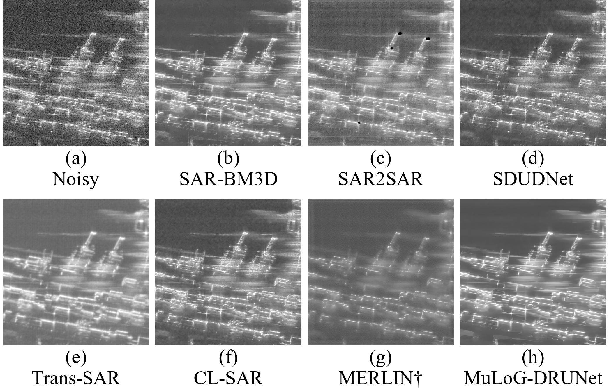
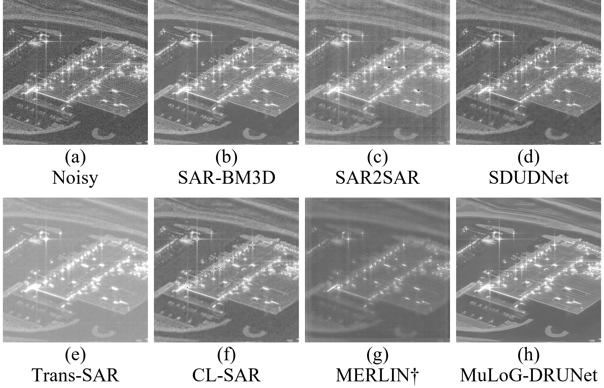
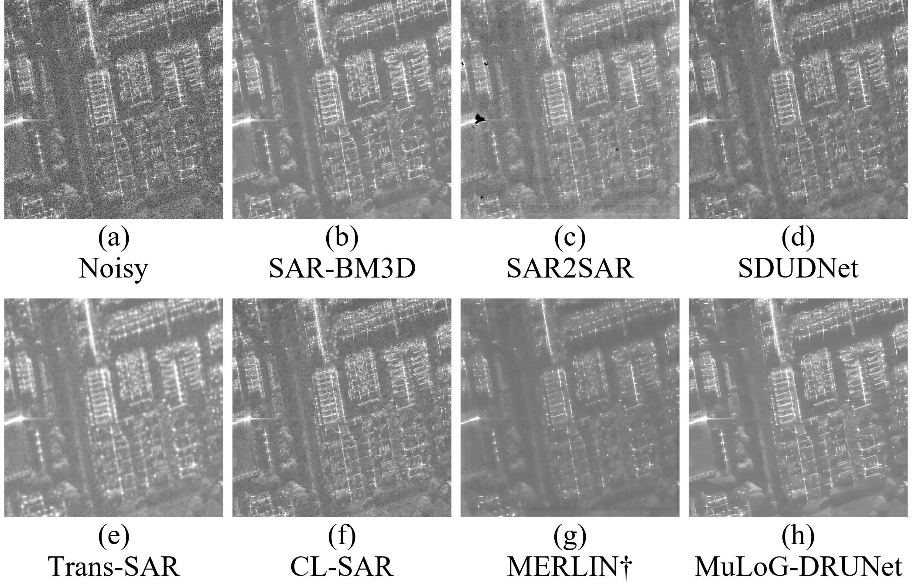

# Umbra 三处不同场景的七方法 SAR 去斑实验

实验日期：2026-09-24  
数据：Umbra Open Data 的三次独立获取（香港港区、内华达工业厂区、墨尔本城区）  
方法：SAR-BM3D、SAR2SAR、SDUDNet、Trans-SAR、CL-SAR、MERLIN、MuLoG-DRUNet

## 1. 目的与结果摘要

针对前一组三幅测试图在论文小图尺寸下地物不够清楚的问题，本次**重新选择了三个地点、三次获取的原始复数 SAR 产品**，不是从 Fig. 3 原图或同一张 SICD 里重复裁剪。选图阶段只检查原始含斑图；在固定 ROI 后才运行去斑方法。香港图包含码头与水面，内华达图突出厂房屋面和道路，墨尔本图呈现密集街区网格，因而小图里的地物类型和轮廓更容易辨认。

三个 1024×1024 ROI × 七种方法共 **21 次推理均已完成**。每处生成一张与论文 Fig. 3 相同 2×4 布局的 2091×1345 像素、600 dpi 对比图，并保留各方法单图、ratio 图、数值数组及运行记录。主图目视检查未发现空白、错位或整体过曝；Tesla 厂区的屋面最易辨认，墨尔本的密集纹理仍比另两处拥挤。

这些真实 SAR 获取**没有无斑地面真值**。以下结果只能讨论可视效果和无参考诊断，不能计算真实 PSNR/SSIM，也不能据此宣布某方法绝对最优。

## 2. 数据来源与三处场景

数据来自 [Umbra Open Data](https://umbra.space/open-data/) 的[公开 STAC 目录](https://s3.us-west-2.amazonaws.com/umbra-open-data-catalog/stac/catalog.json)。本次实际下载并用于计算的是三幅完整 **SICD（Sensor Independent Complex Data）** 文件：它们记录复数 SAR 像素及成像元数据；“原始 SICD”指输入产品格式，**不意味着三个 ROI 来自同一幅图**。每处使用不同的获取 ID 和日期。低分辨率 GEC 概览只用于候选场景筛选；完整 GEC 未下载，亦未被当成真值。

| 场景及地物 | 获取日期 | 标称分辨率 | 入射角 | 轨道／视向 | SICD 大小 | ROI 起点 (row, col) | ROI 中心经纬度 |
|---|---|---:|---:|---|---:|---:|---|
| 香港港区：水面、码头、海岸 | 2025-03-07 | 0.35 m | 43.3° | 升轨／右视 | 7.664 GB | (11673, 24732) | 22.339270, 114.129194 |
| Tesla Semi Factory，内华达：厂房、道路 | 2025-02-21 | 0.25 m | 41.8° | 降轨／左视 | 12.856 GB | (12692, 38983) | 39.555336, −119.439536 |
| 墨尔本城区：密集街区网格 | 2025-06-28 | 0.25 m | 42.8° | 降轨／左视 | 6.655 GB | (1000, 5800) | −37.855800, 144.872721 |

三处均为 X 波段、Spotlight、VV 极化。所选 SICD 的像素格式均为 `RE32F_IM32F`。源文件与精确采集元数据见[选图记录](../umbra_scene_selection/selected_diverse_scenes_v2.json)及 E 盘各场景的 `download_manifest.json`、`.stac.v2.json`。其中供应商 STAC 的 GEC 元数据所列方位向 looks 为香港 2、Tesla 2、墨尔本 1；本实验的去斑适配器统一使用 `L=1`。因此不能把“统一设置 L=1”表述为“供应商三景均为严格单视”，也不应混淆 SICD 和 GEC 的元数据。

| 场景 | 完整 SICD 像素尺寸 | 行／列采样间隔 (m) | 行／列冲激响应宽度 (m) |
|---|---:|---:|---:|
| 香港 | 19008×50400 | 0.2167 / 0.1445 | 0.2400 / 0.1600 |
| Tesla | 26620×60368 | 0.1505 / 0.1111 | 0.1667 / 0.1231 |
| 墨尔本 | 26620×31250 | 0.1535 / 0.2196 | 0.1700 / 0.2432 |

### 真值边界

SICD 复数数据是一次真实含斑观测，不是无斑反射率图。相同获取的 GEC 只是地理编码产品，不能作为 clean ground truth。本文没有多时相配准平均形成的伪参考，也没有地面实测散射真值。因此不报告 PSNR、SSIM 或“真值误差”；若论文必须提供全参考指标，应另设有配对参考的实验，而不是给本组三图补造真值。

## 3. 统一实验协议

先从每幅完整 SICD 的**原始 noisy 预览**中固定一块 1024×1024 ROI；其位置记录于各自的 `roi/run.json`。统一科学输入为 `I = real(S)^2 + imag(S)^2`（float32 线性强度），不做空间重采样或额外辐射定标。七方法沿用论文 Fig. 3 的适配器及公开权重；SAR-BM3D 和 MuLoG-DRUNet 的单视参数设为 `L=1`，MERLIN 使用复数实部／虚部输入。SDUDNet 使用固定 noisy dB 窗口的显示域适配器，因而其输出与纯线性强度方法的物理尺度可比性有限。具体权重、patch 设置和每次推理的输入／输出契约可在各 `experiment/runs/` 下的 `run.json` 或 `summary.json` 复核。

三图各自从 noisy 强度的 dB 值取 **2%–99% 分位数**作为该场景八面板共享的显示窗，不对其他方法单独拉伸。按此前 Fig. 3 的显示要求，MERLIN 主图另外做**仅限显示**的中位亮度对齐：其显示 dB 值分别减去 10.87 dB（香港）、11.40 dB（Tesla）和 6.61 dB（墨尔本）。原始科学数组及 ratio 未修改，且均保留了不做此平移的严格共享灰度版本。**不同场景之间的显示窗并不相同**，不宜比较三张主图的绝对亮度。

## 4. Fig. 3 式结果图

面板顺序均为：(a) Noisy、(b) SAR-BM3D、(c) SAR2SAR、(d) SDUDNet、(e) Trans-SAR、(f) CL-SAR、(g) MERLIN、(h) MuLoG-DRUNet。

### 香港港区

水面与码头的明暗对照可见。SAR-BM3D 抑制颗粒同时留下主要岸线和强散射结构；SAR2SAR 的局部孤立黑点、MERLIN 对小结构的平滑在这幅图上较容易发现。

### 内华达 Tesla Semi Factory

矩形厂房屋面和弧形道路在论文小图尺寸下仍清楚，是本组三处中最易辨认的构图。不同方法对屋面边缘和弱纹理的保留程度可直接比较；Trans-SAR 与 MERLIN 看起来更柔和。

### 墨尔本城区

规则街区线条可辨，但纹理密集，局部细节比厂区图拥挤。CL-SAR 和 SAR-BM3D 留下较多主要线条；MuLoG-DRUNet 在部分低回波区域呈分段式均质化。以上均是**定性观察**，不等同于去斑误差排序。

## 5. Ratio 诊断与跨场景变化

ratio 采用未做显示平移的科学数组计算：`R_dB = 10 log10(I_noisy / I_output)`。负中位数表示该次含斑观测相对输出的整体比例关系，**不是**输出高估真实后向散射的证据。IQR 是 ratio 中间 50% 的散布宽度；其小或大都可能与平滑、细节保留及适配器尺度有关，不能当成单独的质量分数。

| 方法 | 香港中位 ratio (dB) | Tesla (dB) | 墨尔本 (dB) | 三景范围 (dB) | 平均 IQR (dB) |
|---|---:|---:|---:|---:|---:|
| SAR-BM3D | −1.35 | −1.44 | −1.38 | 0.09 | 6.34 |
| SAR2SAR | −2.54 | −2.52 | −1.63 | 0.91 | 6.33 |
| SDUDNet | +0.10 | −0.08 | −0.04 | 0.18 | 6.24 |
| Trans-SAR | −4.26 | −7.33 | −2.75 | 4.58 | 7.13 |
| CL-SAR | −0.76 | −1.79 | −0.54 | 1.25 | 6.72 |
| MERLIN | −10.58 | −11.25 | −6.72 | 4.53 | 7.57 |
| MuLoG-DRUNet | −1.60 | −1.73 | −1.70 | 0.13 | 6.89 |

在**这三个固定 ROI** 上，SAR-BM3D 的中位 ratio 变化范围较小（0.09 dB），且主图的主要轮廓保留较一致；MuLoG-DRUNet 的该值也小（0.13 dB），但局部均质化说明“全局比例稳定”不等于“视觉细节最佳”。Trans-SAR 和 MERLIN 的范围分别为 4.58 和 4.53 dB，显示不同场景下输出比例变化较明显。MERLIN 主图的显示平移不参与这些统计。该表仅是三块图的**描述性跨场景诊断**，不能推广为方法总体泛化性能排名。

逐场景 21 行数值见 [`stability_diagnostics.csv`](stability_diagnostics.csv)；JSON 还保存 ratio 定义、邻域相关和每次适配器的计时，但后两类量同样不能替代无斑真值评价。各场景 `figure3_style/ratios/` 还提供七种方法的 ratio PNG 和 NPY。

## 6. 数据完整性与复现

完整 SICD 保存在 `E:\SAR_Data\Umbra\Stability_3Scenes_V2` 的三个场景子目录中。以下 SHA-256 是**完整原始 SICD 文件**的校验值，下载清单同时记录并校验供应商 ETag。目录下如果存在候选筛选的临时文件，不属于本组三个实验输入。

| 场景 | 获取 ID | SICD SHA-256 |
|---|---|---|
| 香港 | `4813568f-0ba2-42de-bc54-4daf93870314` | `bfe8fd837b262f41ef8b3dbcca240ce8a5293f8c12dfcd7f038abc68fbc4e1b3` |
| Tesla | `d0f7a19e-61ca-4048-aa87-e589d19f2a60` | `f56f0983214cb00cbbe374ee08edc2797f1dfe36e4709cecdf3b744b911d6ae3` |
| 墨尔本 | `2a5ed3e3-502d-4c58-bde1-c1a73a80498e` | `7503e7b6058166a0cd336f683d8695a50fe0e56fbb6a772bddb1f7fd00ec2113` |

本报告同级目录下每个场景包含：`roi/run.json`（来源、裁剪位置、输入校验）；`experiment/experiment_state.json`（七方法完成状态）；`experiment/figure3_style/manifest.json`（主图、单图、ratio 和科学数组的文件校验）；`experiment/figure3_style/scientific_arrays.mat`（未做显示平移的结果数组）。可复现入口为仓库内 `scripts/prepare_umbra_stability_roi.py`、`scripts/run_umbra_stability_methods.py`、`scripts/render_umbra_stability_comparison.py` 和 `scripts/summarize_umbra_stability.py`。新场景选择与下载过程另见 `scripts/probe_umbra_visual_candidates.py`、`scripts/download_umbra_diverse_v2.py`。

## 7. 参考资料与方法代码

1. [Umbra Open Data](https://umbra.space/open-data/)；本次目标的官方 STAC JSON 与 SICD 直链保存在[选图记录](../umbra_scene_selection/selected_diverse_scenes_v2.json)。
2. SAR-BM3D：[Parrilli 等，IEEE TGRS](https://doi.org/10.1109/TGRS.2011.2161586)。
3. SAR2SAR：[论文](https://doi.org/10.1109/JSTARS.2021.3071864)、[代码](https://gitlab.telecom-paris.fr/ring/sar2sar)。
4. SDUDNet：[代码](https://github.com/BFY-official/SDUDNet)。
5. Trans-SAR：[代码](https://github.com/malshaV/sar_transformer)。
6. CL-SAR：[论文](https://doi.org/10.1016/j.isprsjprs.2024.11.003)、[代码](https://github.com/YangtianFang2002/CL-SAR-Despeckling)。
7. MERLIN：[论文](https://arxiv.org/abs/2110.13148)、[代码](https://github.com/hi-paris/deepdespeckling)。
8. MuLoG-DRUNet：[代码](https://gitlab.telecom-paris.fr/ring/mulog-drunet)。
